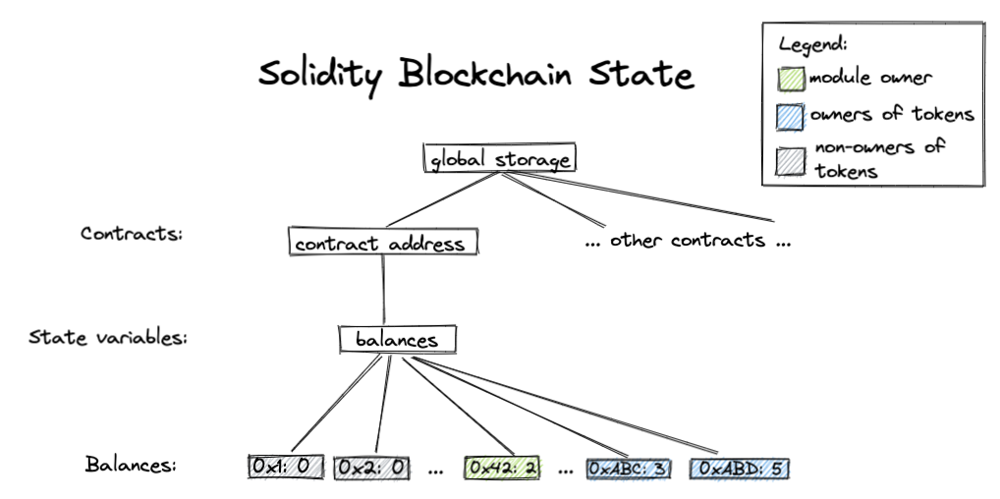

# Move Tutorial

Добро пожаловать в руководство по языку Move! Здесь вы сможете найти пошаговое описание по разработке проекта на Move, включающее дизайн, реализацию, юнит тестирование и формальную верификацию модулей на Move.

Всего будет 9 шагов:

- [Шаг 0: Установка](#Step0)
- [Шаг 1: Мой первый модуль на Move](#Step1)
- [Шаг 2: Добавляем юнит тесты](#Step2)
- [Шаг 3: Дизайн модуля `BasicCoin`](#Step3)
- [Шаг 4: Реализация модуля `BasicCoin`](#Step4)
- [Шаг 5: Добавление юнит тестов в `BasicCoin`](#Step5)
- [Шаг 6: Релизация `BasicCoin` с поддержкой generics](#Step6)
- [Шаг 7: Использование Move prover](#Step7)
- [Шаг 8: Написание формальной спецификации для `BasicCoin`](#Step8)

Код каждого шага находится в дирректории `step_x` и является самодостаточным. То есть если например вы решите пропустить все шаги с шага 1 до шага 4 - смело переходите к дирректории `step_5` - в ней уже будет весь код написаный в предыдущих шагах. Так же в конце некоторых шагов мы выключили список дополнительных материалов на более продвинутые темы.

Можно начинать!

## Step 0: Установка<span id="Step0"><span>

Если вы не делали этого ранее, то откройте терминал и склонируйте [репозиторий Diem](https://github.com/diem/diem) и [репозиторий Move](https://github.com/diem/move):

```bash
git clone https://github.com/diem/diem.git
git clone https://github.com/diem/move.git
```

Перейдите в директорию `diem` и запустите `dev_setup.sh` скрипт:

```bash
cd diem
./scripts/dev_setup.sh -ypt
```

Ответьте на приглашения скрипта чтобы установить все необходимые зависимости.

Скрипт добавит переменные окружения в ваш `~/.profile` файл. Выполните следующую команду чтобы изменения вступили в силу:

```bash
source ~/.profile
```

Затем нужно установит инструменты командной строки, запустив следующие команды:

```bash
cd ..
cargo install --path diem/diem-move/df-cli
cargo install --path move/language/move-analyzer
```

Чтобы проверить что все установлено успешно, можно выполнить следующую команду:

```
move-analyzer --version  # Выведет: move-analyzer 0.0.0
```

Команда `df-cli` это удобный враппер над интерфейсом командной строки `move`. Для простоты в этом руководстве мы будем называть его просто `move`. Чтобы было еще проще вы можете добавить вот такй alias командной строки:

```bash
alias move="df-cli"
```

Чтбы проверить что он работает можно запустить команду:

```bash
move package -h
```

После чего в консоли появится вывод вроде указаного ниже:

```
move-package 0.1.0
Package and build system for Move code.

USAGE:
    move package [FLAGS] [OPTIONS] <SUBCOMMAND>
...
```

Чтобы получить более подробное описание команд `move` а так же описание того что они делают, можно запустить команду с флагом `-h`.

Так же можно включить поддержку языка `Move` в Visual Studio Code. Чтобы это сделать можно найти плагин который называется "move-analyzer" во вкладке Extensions и установить его. Более детальные инструкции можно найти в [README](https://github.com/diem/move/tree/main/language/move-analyzer/editors/code).

Перед следующими шагами нужно перейти в директорию руководсва:

```bash
cd <path_to_move_repo>/language/documentation/tutorial
```

## Шаг 1: Мой первый модуль на Move<span id="Step1"><span>

Перейдтие в директорию [`step_1/BasicCoin`](./step_1/BasicCoin). Там вы увидите дирректорию `sources` -- это место где живет весь код проекта. Вы так же увидите файл `Move.toml` -- он описывает зависимости и другую информацию о пакете; если вы знакомы с языком Rust и Сargo, то `Move.toml` может вам показаться похожим на `Cargo.toml`, а директория `sources` похожей на `src`.

Давайте посмотрим на код написанный на Move! Откройте [`sources/FirstModule.move`](./step_1/BasicCoin/sources/FirstModule.move) в своем любимом редакторе. Первое что вы увидите будет:

```
// sources/FirstModule.move
module 0xCAFE::BasicCoin {
    ...
}
```

Это объявление [модуля](https://diem.github.io/move/modules-and-scripts.html).
Модули - строительные блоки кода на Move, и их определние влючает адрес -- адрес по которому этот модуль будет опубликован. В этом случае `BasicCoin` модуль может быть опубликован только по адресу `0xCAFE`.

Теперь давайте взглянем на следующую часть этого файла где идет объявление [структуры](https://diem.github.io/move/structs-and-resources.html) которая описывет сущность `Coin` у которой может быть задано значение в поле `value`:

```
module 0xCAFE::BasicCoin {
    struct Coin has key {
        value: u64,
    }
    ...
}
```

Глядя на оставшуюся часть файла можно увидеть объявление функции, которая создает структуру `Coin` и помещает ее на аккаунт:

```
module 0xCAFE::BasicCoin {
    struct Coin has key {
        value: u64,
    }

    public fun mint(account: signer, value: u64) {
        move_to(&account, Coin { value })
    }
}
```

Давайте посмотрим на эту функцию и то что она делает:

- Она принимает агрумент [`signer`](https://diem.github.io/move/signer.html) -- это такой неподделываемый токен, который является подтверждением владения адресом и аргумент `value`, в котором указано сколько нужно создать монет.

- И создает структуру `Coin` с указаным значением `value`, после чего помещает ее на указанный в первом агрументе аккаунт, используя оператор `move_to`.

Давайте проверим что все собирается! Чтобы это сделать нужно запустить команду `pacakge build` и дирректории проекта ([`step_1/BasicCoin`](./step_1/BasicCoin/)):

```bash
move package build
```

<details>
<summary>Продвинутые концепции и ссылки</summary>

- Можно создавать пустые пакеты Move, вызывая команду:

  ```bash
  move package new <pkg_name>
  ```

- Код Move может жить и в разных местах. Подробнее об этом можно прочитать в
  [книге](https://diem.github.io/move/packages.html)

- Больше информации о `Move.toml` можно найти в [разделе про пакеты Move](https://diem.github.io/move/packages.html#movetoml).

- В Move есть поддержка [именованных адресов](https://diem.github.io/move/address.html#named-addresses). Именованные адреса - это такой способ задавать адреса, чтобы их можно было задавать параметрами во время компиляции. Они используются довольно часто и могут быть заданы в `Move.toml` файле в разделе `[addresses]`. Например:
  ```
  [addresses]
  SomeNamedAddress = "0xC0FFEE"
  ```
- [Структуры](https://diem.github.io/move/structs-and-resources.html) в Move могут обладать различными [способностями](https://diem.github.io/move/abilities.html) которые описывают какие операции допустимы с этим типом:
  Всего есть четыре способности:
  - `copy`: Значения этого типа могут быть скопированы.
  - `drop`: Значения этого типа могут быть удалены.
  - `store`: Значения этого типа можно хранить внутри структур в глобальном хранилище.
  - `key`: Этот тип можно использовать как ключ для операций с глобальным хранилищем. (Примечание: тут имеется в виду что можно передавать этот тип в конструкции типа `borrow_global_mut<Coin>`)

Так вот в `BaseCoin` у структуры `Coin` есть только возможность быть использованной в качестве ключа к глобальному хранилищу и из-за того что других способностей не указано - ее нельзя копировать, удалять или хранить внутри других структур. Так что вы не можете копировать монеты и не можете их случайно потерять!

- [Функции](https://diem.github.io/move/functions.html) по умолчанию приватны, но могут быть объявлены как `public`,[`public(friend)`](https://diem.github.io/move/friends.html) или `public(script)`. `public(script)` позволяет вызывать функцию из скриптов транзакций или из других `public(script)` функций.

- `move_to` - это один из [пяти операций работы с глобальным хранилищем](https://diem.github.io/move/global-storage-operators.html).
</details>

## Шаг 2: Добавляем юнит тесты<span id="Step2"><span>

Мы познакомились с первым модулем, теперь настало время узнать как писать тесты. Тесты нужны чтобы быть уверенным в том что минтинг монет работает как мы и задумывали. Для этого переходим в директорию [`step_2/BasicCoin`](./step_2/BasicCoin). Юнит тесты в Move похожи на юнит тесты в Rust -- они аннотируются директивой `#[test]` а в остальном это обычные функции.

Чтбы запустить тесты нужно выполнить команду `package test`:

```bash
move package test
```

Давайте теперь посмотрим в код файла [`FirstModule.move`](./step_2/BasicCoin/sources/FirstModule.move). Первое изменение которое вы увидите это тест:

```
module 0xCAFE::BasicCoin {
    ...
    // Declare a unit test. It takes a signer called `account` with an
    // address value of `0xC0FFEE`.
    #[test(account = @0xC0FFEE)]
    fun test_mint_10(account: signer) acquires Coin {
        let addr = Signer::address_of(&account);
        mint(account, 10);
        // Make sure there is a `Coin` resource under `addr` with a value of `10`.
        assert!(borrow_global<Coin>(addr).value == 10, 0);
    }
}
```

Он описывает тест, который называется `test_mint_10` котрый минтит монету `Coin` на аккаунте `account` со значением `value` равным `10`. После чего проверяет что состояние хранилища соответствует ожидаемому. Это делается с помощью вызова `assert!`. Если `assert!` падает - юнит тест тоже падает.

<details>
<summary>Продвинутые концепции и упражнения</summary>

- Существует несколько аннотаций, относящихся к тестированию, которые стоит изучить. Их можно найти [тут](https://github.com/diem/move/blob/main/language/changes/4-unit-testing.md#testing-annotations-their-meaning-and-usage).
  Некоторые из них вы увидите позже на шаге 5.

- До запуска тестов всегда нужно убедиться что вы добавили стандартную библиотеку Move в зависимости. Чтобы это сделать нужно добавить запись в раздел `[dependencies]` файла `Move.toml`:

  ```toml
  [dependencies]
  MoveStdlib = { local = "../../../../move-stdlib/", addr_subst = { "Std" = "0x1" } }
  ```

Обратите внимание что вам может понадобитсья указать ваш правильный путь до `move-stdlib` который находится в `<path_to_diem>/language`. Так же можно указыват зависимости находящиеся в гит репозитории. Больше об этом можно прочитать [тут](https://diem.github.io/move/packages.html#movetoml).

#### Упражнения

- Измените assert проверку на `11` чтобы тесту упал. Найдите флаг который можно передать в команду `move package test` чтобы она показывала вам состояние глобального стораджа в случе если тест завершается с ошибкой. Должно выглядеть как-то так:
  ```
    ┌── test_mint_10 ──────
    │ error[E11001]: test failure
    │    ┌─ step_2/BasicCoin/sources/FirstModule.move:22:9
    │    │
    │ 18 │     fun test_mint_10(account: signer) acquires Coin {
    │    │         ------------ In this function in 0xcafe::BasicCoin
    │    ·
    │ 22 │         assert!(borrow_global<Coin>(addr).value == 11, 0);
    │    │         ^^^^^^^^^^^^^^^^^^^^^^^^^^^^^^^^^^^^^^^^^^^^^^^^^ Test was not expected to abort but it aborted with 0 here
    │
    │
    │ ────── Storage state at point of failure ──────
    │ 0xcafe:
    │       => key 0xcafe::BasicCoin::Coin {
    │           value: 10
    │       }
    │
    └──────────────────
  ```
- Find a flag that allows you to gather test coverage information, and
  then play around with using the `move package coverage` command to look at
  coverage statistics and source coverage.
- Найдите флаг который позволяет собирать информацию об уровне покрытия кода тестами, после чего поэксперементируйте с командой `move package coverate` чтобы посмотреть различную статистику.

</details>

## Шаг 3: Дизайн модуля `BasicCoin`<span id="Step3"><span>

В этой секции мы задизайним модуль монеты и интерфейс баланса. Монеты можно минтить и отправлять на балансы разных адресов.

Публичный интерфейс модуля состоит из следующих функций:

```
/// Создать нулевой баланс по указанному адресу. Эта функция должна быть вызывана до минтинга или передачи монет по этому адресу
public fun publish_balance(account: &signer) { ... }

/// Заминтить монеты по указанному адресу. Минтинг делается владельцем модуля монеты
public fun mint(module_owner: &signer, mint_addr: address, amount: u64) acquires Balance { ... }

/// Узнать баланс адреса
public fun balance_of(owner: address): u64 acquires Balance { ... }

/// Передать монеты с одного адреса на другой
public fun transfer(from: &signer, to: address, amount: u64) acquires Balance { ... }
```

Теперь посмотрим какие для этого нам понадобятся структуры.

У модуля в Move нет своего собственного хранилища. Вместо этого есть "глобальное хранилище" (то что мы называем состоянием блокчейна) поиск в котором осуществляется по адресу. По каждому адресу могут находиться модули (код) и ресурсы (значения). Проще говоря глобальное имеет следущую структуру (если выражаться на Rust):

```rust
struct GlobalStorage {
    resources: Map<address, Map<ResourceType, ResourceValue>>
    modules: Map<address, Map<ModuleName, ModuleBytecode>>
}
```

Хранилище по каждому адресу по сути является маппингом типов к значениям. (Внимательный читатель мог подметить что это означает что каждый адрес может содержать только одно значения для каждого типа ресурса). В нашем модуле `BasicCoin` мы определяем ресурс `Balance` который отражает сколько монет находится по адресу:

```
/// Struct representing the balance of each address.
struct Balance has key {
    coin: Coin // same Coin from Step 1
}
```

Упрощенное представление состояния блокчейна:


#### Продвинутые топики:

<details>
<summary><code>public(script)</code> функции</summary>

Только функции с `public(script)` видимостью могут быть вызваны напрямую из скриптов транзакций. Так что если выхотите вызывать функцию `transfer` из транзакции то вам нужно изменить сигнатуру функции на:

```
public(script) fun transfer(from: signer, to: address, amount: u64) acquires Balance { ... }
```

Узнать больше об областях видимости функций можно [тут](https://diem.github.io/move/functions.html#visibility).

</details>
<details>
<summary>Сравнение с Ethereum/Solidity</summary>

В большинстве [ERC-20](<(https://ethereum.org/en/developers/docs/standards/tokens/erc-20/)>) контрактов состояние баланса каждого адреса хранится в переменной типа <code>mapping(address => uint256)</code>. Эта переменная хранится в хранилище конкретного смарт контракта.

Состояние блокчейна в Ethereum выглядит примерно так:



</details>

## Шаг 4: Реализация модуля `BasicCoin`<span id="Step4"><span>

Мы уже подготовили для вас пакет Move в дирректории `step_4` который называется `BasicCoin`. В директории `sources` уже лежат исходники для всех модулей, включая `BasicCoin.move`. В этом разделе мы подробней разберем реализацию методов[`BasicCoin.move`](./step_4/BasicCoin/sources/BasicCoin.move).

### Компилируем код

Давайте сначала соберем проект запустив команду в директории [`step_4/BasicCoin`](./step_4/BasicCoin):

```bash
move package build
```

### Реализация методов

Теперь посмотрим на реализацию методов в [`BasicCoin.move`](<(./step_4/BasicCoin/sources/BasicCoin.move)>).

<details>
<summary>Метод <code>publish_balance</code></summary>

Этод метод публикует ресурс `Balance` по заданному адресу. Это нужно для того чтобы владелец адреса мог получать заминченные или переданные другим владельцем монеты. `publish_balance` должен быть вызван самим владельцем адреса до начала других операций.

Этот метод использует операцию `move_to` для публикации ресурса:

```
let empty_coin = Coin { value: 0 };
move_to(account, Balance { coin:  empty_coin });
```

</details>
<details>
<summary>Метод <code>mint</code></summary>

Метод `mint` минтит монеты на заданный аккаунт. Этот вызов должен быть одобрен владельцем модуля и мы убеждаемся в этом используя assert:

```
assert!(Signer::address_of(&module_owner) == MODULE_OWNER, Errors::requires_address(ENOT_MODULE_OWNER));
```

Assert имеет следующую сигнатуру: `assert!(<predicate>, <abort_code>);`. Это выражение значит что если `<predicate>` равен false то транзакция прервется с кодом `<abort_code>`. В выражении свержу `MODULE_OWNER` и `ENOT_MODULE_OWNER` - константы определенные в начале модуля. Модуль `Errors` содержит общие категории ошибок которые мы можем использовать.
Важно понимать что выполнение кода на Move транзакционно -- это значит что если исполнение [прервется](https://diem.github.io/move/abort-and-assert.html), то не потребуется откатывать какие-либо операции, так как в этом случае в блокчейн записано ничего не будет.

После чего мы пополняем монеты в колличестве `value` на баланс `mint_addr`.

```
deposit(mint_addr, Coin { value: amount });
```

</details>

<details>
<summary>Метод <code>balance_of</code></summary>

Тут мы используем `borrow_global` - один из операторов работы с глобальным стораджем предназначенный для чтения.

```
borrow_global<Balance>(owner).coin.value
                 |       |       \    /
        resource type  address  field names
```

</details>

<details>
<summary>Метод <code>transfer</code></summary>

Эта функция снимает токены с баланса счета c адреса `from` и помещает их на баланс адреса `to`. Вот как выглядит эта функция:

```
fun withdraw(addr: address, amount: u64) : Coin acquires Balance {
    let balance = balance_of(addr);
    assert!(balance >= amount, EINSUFFICIENT_BALANCE);
    let balance_ref = &mut borrow_global_mut<Balance>(addr).coin.value;
    *balance_ref = balance - amount;
    Coin { value: amount }
}
```

В начале метода мы проверяем что на на адресе списания достаточно токенов на балансе. После чего используем `borrow_global_mut` чтобы получить ссылку с возможностью записи в глобальное хранилище, а оператор `&mut` нужен для того чтобы создать ссылку с [возможностью записи](https://diem.github.io/move/references.html) на поле структуры. После чего модифицируем баланс через полученную ссылку и возвращаем новую монету со значением равным тому что было только что списано.

</details>

### Упражнения

В нашем модуле есть два `TODO`, которые можно реализовать чтобы потренироваться:

- Допишите метод `publish_balance`.
- Реализуйте метод `deposit`.

Решение этого упражнения можно найти в дирректории [`step_4_sol`](./step_4_sol).

**Бонусные упражнения**

- Что произойдет если мы попытаемся перевести слишком много токенов на баланс?
